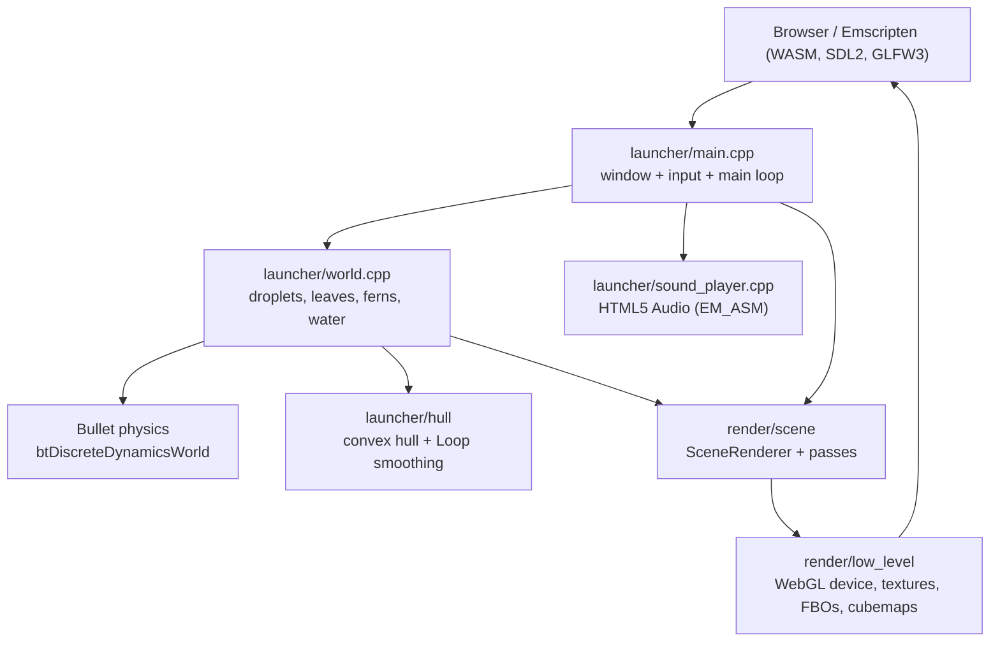

# Changelog

This document is **reconstructed from the project's git history**. The demo was
never formally versioned or released, so there are no version tags or release
dates to report. What follows is a *development history*: a record of a single,
intensive build sprint that ran from **June 10 to June 24, 2023**, during which
a C++17/WebAssembly rendering engine and a physics-based water-droplet demo were
written essentially from scratch.

Two contributors did the work:

- **Leny Kholodov** — engine architecture, the low-level and scene renderers,
  asset/OBJ loading, Bullet physics integration, droplet/leaf gameplay,
  envmaps & mirrors, the convex hull builder, water surface and skybox.
- **Ievgen Mukhin** — audio (background music + droplet SFX), touch-screen
  input, camera setup, leaf dragging, and fullscreen/canvas handling.
  *(Attributed below as `(IM)`.)*

The project targets the browser via [Emscripten](https://emscripten.org): it
compiles to `WASM=1`, uses `USE_SDL=2`, `USE_GLFW=3`, and links Bullet through
`-s USE_BULLET=1` (see [Makefile](../Makefile)). The entry point is
[src/launcher/main.cpp](../src/launcher/main.cpp), and the gameplay simulation
lives in [src/launcher/world.cpp](../src/launcher/world.cpp).

The format is loosely based on [Keep a Changelog](https://keepachangelog.com/).
Dates and facts below are grounded in the actual commits and source files; no
version numbers or dates have been invented.

---

## [Unreleased]

### In progress — open-source preparation

Work to prepare this demo for public release is ongoing. As of the latest state
of the repository:

- A `docs/` tree (this changelog) is being added.
- Branch consolidation is underway: `dev` holds the full granular history (HEAD),
  while `main` / `public/main` carry a single squashed *"Demo WebAssembly project"*
  commit and `origin/main` carries *"WebGL + WebAssembly demo project"*.
- A working-tree git stash dated 2026-06-15 exists on `main`.
- Build/deploy helpers present but not yet polished for distribution:
  [Makefile](../Makefile), [run-webserver.sh](../run-webserver.sh),
  [deploy.sh](../deploy.sh), [readme.md](../readme.md).

> No functional engine or gameplay changes are part of this open-source-prep
> work — it is repository hygiene only.

---

## Development history (June 2023 sprint)

Listed reverse-chronologically and grouped by milestone. Each section maps to one
or more days of the sprint.

### 2023-06-24 — Water surface, skybox & launcher polish

The final day of the sprint added the environment and tidied the demo into a
launchable state.

- **Water surface.** A procedural `128 × 128` grid mesh is generated in
  [world.cpp](../src/launcher/world.cpp) (`WATER_SURFACE_GRID_SIZE = 128`),
  spanning `GROUND_SIZE * 5` and offset just below the ground plane. It reuses
  the `"droplet"` material for its reflective look and is seeded with random
  ripples (`U[WATER_SURFACE_GRID_SIZE][WATER_SURFACE_GRID_SIZE]`).
- **Skybox.** A sky sphere of radius `100` is created via
  `MeshFactory::create_sphere(SKY_MATERIAL, SKY_RADIUS, …)` and rendered with a
  cubemap loaded through `Device::create_texture_cubemap(...)` and a dedicated
  `"sky"` shader tag (see [media/shaders/sky.glsl](../media/shaders/sky.glsl)).
- **"Dirty code to launcher" / final fixes.** Gameplay glue was consolidated
  into [src/launcher/](../src/launcher/) and last-minute fixes were applied.

*Contributor: Leny Kholodov.*

### 2023-06-23 — Gameplay configuration, ferns, fullscreen & audio integration

The largest single-day push: the demo became playable and the audio/input layers
were wired up.

- **Gameplay & droplet tuning.** Droplet falling, lighting, and droplet
  parameters were configured; clusterization fixes were applied. Tuning
  constants live at the top of [world.cpp](../src/launcher/world.cpp)
  (`DROPLET_PARTICLE_RADIUS`, `MAX_PARTICLES_COUNT = 90`,
  `DROPLET_GENERATION_INTERVAL`, friction/collision-group constants, etc.).
- **Ferns.** Plant meshes ([media/meshes/fern.obj](../media/meshes/fern.obj))
  were added and the bottom leaf removed.
- **Fullscreen / canvas (IM).** Canvas fullscreen handling was added, then
  temporarily disabled, then reinstated.
- **Audio (IM).** Music updates, droplet SFX wiring, a sound-playback fix, and
  a compilation fix. SFX are driven from
  [src/launcher/sound_player.cpp](../src/launcher/sound_player.cpp) via
  `EM_ASM` HTML5 `Audio` (`water-drop.wav`, `water-droplet.wav`, `music.mp3`).
- **Camera setup (IM).** Aspect-ratio-aware camera placement
  (`CAM_POS_AR_16_9` / `CAM_POS_AR_1_1` / `CAM_POS_AR_9_16` in
  [main.cpp](../src/launcher/main.cpp)).
- **Restarting music.** Music restart logic in `SoundPlayer::update()`
  (`MUSIC_PLAY_TIME`).

*Contributors: Leny Kholodov (gameplay, lighting, clusterization), Ievgen Mukhin
(audio, camera, fullscreen).*

### 2023-06-22 — Mirrors debugged, Fresnel droplets & droplet physics

Reflection rendering was stabilized and the droplet's optical look and physics
were started.

- **Envmaps / mirrors.** Envmap prerendering was debugged, an exclusion list was
  added so reflective surfaces don't render themselves, and `PassGroups` +
  dispatching were introduced
  ([src/render/low_level/pass_group.cpp](../src/render/low_level/pass_group.cpp)).
- **Fresnel droplet rendering.** Fresnel shading was started for the droplet
  hull ([media/shaders/fresnel.glsl](../media/shaders/fresnel.glsl)), registered
  as the `"fresnel"` pass inside the forward pass group
  ([forward_render_passes.cpp](../src/render/scene_passes/forward_render_passes.cpp)).
- **Droplet physics.** Bullet-driven droplet particle dynamics took shape in
  [world.cpp](../src/launcher/world.cpp) (per-particle `btRigidBody`,
  inter-particle cohesion forces, sleeping thresholds).
- **Drag leaves (IM).** Leaf-dragging interaction.
- **Configure scene.**

*Contributors: Leny Kholodov (rendering, physics), Ievgen Mukhin (leaf drag).*

### 2023-06-21 — Mirrors framebuffer, prerendering stage & touch input

- **SceneRenderer prerendering stage.** A prerender phase was added to the scene
  renderer ([src/render/scene/scene_renderer.cpp](../src/render/scene/scene_renderer.cpp)).
- **Mirrors.** A framebuffer for mirrors and the groundwork for env-map
  prerendering ([mirrors_render_pass.cpp](../src/render/scene_passes/mirrors_render_pass.cpp),
  registered as the `"Mirrors"` pass).
- **Touch screen input (IM).** Emscripten touch callbacks
  (`emscripten_set_touchstart/move/end/cancel_callback` on `"canvas"`) were added
  in [src/application/window.cpp](../src/application/window.cpp), including a hack
  to suppress the bogus mouse events GLFW emits for touch screens.

*Contributors: Leny Kholodov (rendering), Ievgen Mukhin (touch input).*

### 2023-06-20 — Leaf control, droplet clusterization, hull & cubemaps

The droplet/leaf gameplay primitives and cubemap support landed.

- **Leaf control** and **droplet clusterization** (`CLUSTERIZE_STEPS_COUNT`,
  `CLUSTERIZE_STEP_FACTOR` in [world.cpp](../src/launcher/world.cpp)).
- **Convex hull builder.** First version of the droplet hull — a convex-hull
  mesh generator with Loop-style tessellation/refinement smoothing
  ([src/launcher/hull/hull.cpp](../src/launcher/hull/hull.cpp),
  [hull_loop_tesselation_smoother.cpp](../src/launcher/hull/hull_loop_tesselation_smoother.cpp)).
  Sphere-map texcoords were added for the hull.
- **Cubemaps in the low level.** `create_texture_cubemap` was added to the device
  ([include/render/device.h](../include/render/device.h),
  [src/render/low_level/texture.cpp](../src/render/low_level/texture.cpp) with the
  six `GL_TEXTURE_CUBE_MAP_*` faces), enabling env-map work.
- **Background music & click sounds (IM).** First audio integration via the
  `SoundPlayer` ([sound_player.cpp](../src/launcher/sound_player.cpp)).

*Contributors: Leny Kholodov (hull, clusterization, cubemaps), Ievgen Mukhin
(audio).*

### 2023-06-19 — Mesh optimization & first working leaves

- **Mesh rendering optimization.**
- **Convex / leaves.** Work on convex shapes and the leaf entities, culminating
  in the *first working leaves*. Leaf meshes/materials:
  [media/meshes/leaf.obj](../media/meshes/leaf.obj),
  [media/textures/leaf_color.png](../media/textures/leaf_color.png).

*Contributor: Leny Kholodov.*

### 2023-06-18 — Physics integration (Bullet)

- **Bullet enabled.** The Bullet physics library was integrated
  (`-s USE_BULLET=1` in [Makefile](../Makefile);
  `btDiscreteDynamicsWorld` / `btRigidBody` / `btGImpactShape` used in
  [world.cpp](../src/launcher/world.cpp)).

*Contributor: Leny Kholodov.*

### 2023-06-17 — Forward lighting & OBJ asset loading

- **Forward lighting (done).** The forward lighting path was completed
  ([forward_render_passes.cpp](../src/render/scene_passes/forward_render_passes.cpp),
  [media/shaders/forward_lighting.glsl](../media/shaders/forward_lighting.glsl)).
- **OBJ model loading.** Wavefront `.obj` loading was implemented on top of the
  `fast_obj` submodule (`fast_obj_read` in
  [src/media/geometry_mesh_obj_model.cpp](../src/media/geometry_mesh_obj_model.cpp);
  submodule declared in [.gitmodules](../.gitmodules)). First model — *Leaf
  loaded*.

*Contributor: Leny Kholodov.*

### 2023-06-10 — Engine foundation & first image

The sprint opened with the full engine scaffolding, all by Leny Kholodov:

- **Common library** — logging ([include/common/log.h](../include/common/log.h)),
  exceptions, strings, property maps, named dictionaries, and a component system
  with `ComponentScope` ([include/common/component.h](../include/common/component.h)).
- **Application & window** — Emscripten/GLFW window and main loop
  ([src/application/](../src/application/),
  [src/launcher/main.cpp](../src/launcher/main.cpp)).
- **Image / media** ([include/media/image.h](../include/media/image.h)).
- **Scene graph** — nodes, camera, mesh, light, visitor
  ([include/scene/](../include/scene/)).
- **Rendering device** — the low-level WebGL abstraction
  ([src/render/low_level/device.cpp](../src/render/low_level/device.cpp)).
- **Deferred lighting** — initial work (later the demo ships with the *Forward
  Lighting* + *Mirrors* passes enabled in
  [main.cpp](../src/launcher/main.cpp); deferred/LPP passes exist but are
  commented out).
- **First image** rendered.

*Contributor: Leny Kholodov.*

---

## Milestones

| Date (2023) | Milestone               | Highlights                                                            | Contributor(s)        |
| ----------- | ----------------------- | -------------------------------------------------------------------- | --------------------- |
| Jun 10      | Engine foundation       | Common lib, app/window, scene graph, rendering device, first image   | Kholodov              |
| Jun 17      | Rendering & asset load   | Forward lighting done; OBJ loading via `fast_obj`; leaf loaded       | Kholodov              |
| Jun 18      | Physics                 | Bullet integrated (`USE_BULLET=1`)                                    | Kholodov              |
| Jun 19      | Gameplay primitives     | Mesh optimization; first working leaves                               | Kholodov              |
| Jun 20      | Hull & cubemaps         | Convex hull builder + smoothing; cubemaps; first audio               | Kholodov; Mukhin (audio) |
| Jun 21      | Mirrors & touch         | Prerender stage; mirror framebuffer; touch input                     | Kholodov; Mukhin (touch) |
| Jun 22      | Reflections & Fresnel   | Envmaps/mirrors debugged; Fresnel droplet; droplet physics; leaf drag | Kholodov; Mukhin (drag) |
| Jun 23      | Playable demo           | Gameplay/lighting tuning; ferns; fullscreen; SFX & camera            | Kholodov; Mukhin (audio/camera/fullscreen) |
| Jun 24      | Water surface & hull polish | Procedural water grid; skybox; launcher consolidation            | Kholodov              |

---

## Architecture at a glance

The milestones above map onto a layered engine. The flow from the browser down
to the rendered frame:



**Active render passes** in the shipped demo (registered via
`ScenePassFactory::register_scene_pass` and enabled in
[main.cpp](../src/launcher/main.cpp)):

```cpp
scene_renderer.add_pass("Forward Lighting");
scene_renderer.add_pass("Mirrors");
// "LPP-GeometryPass", "Deferred Lighting",
// "Projectile Maps Rendering" exist but are disabled.
```
