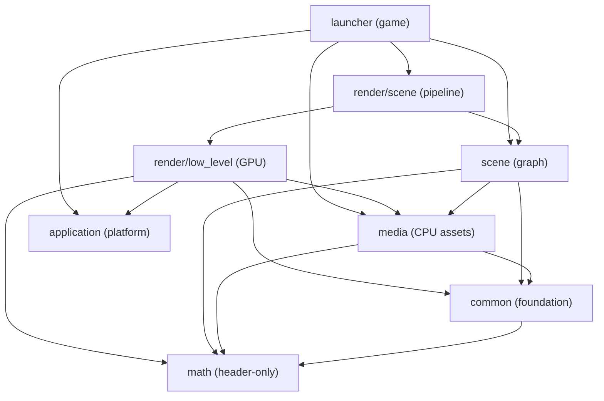
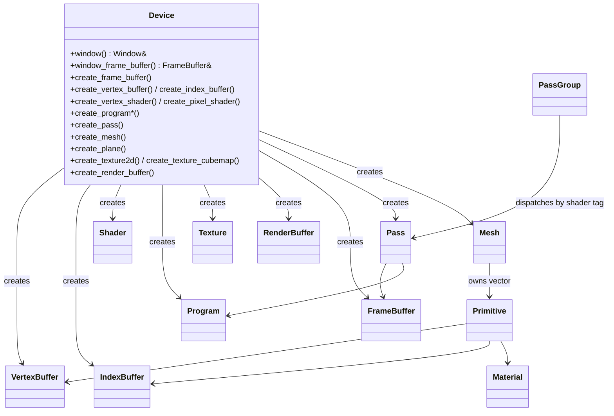
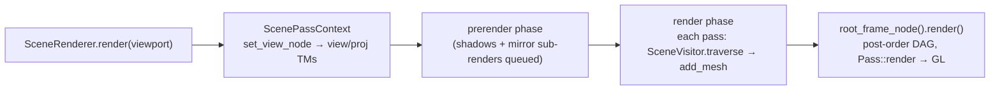
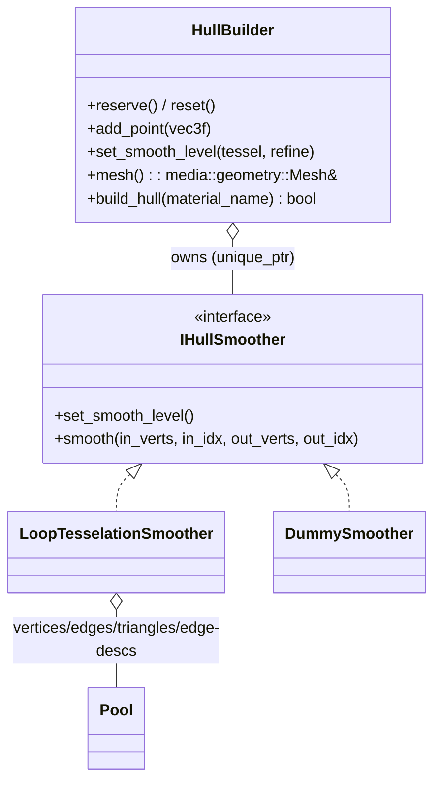

# Entities & Key Types Catalog

A reference of the important classes, structs, and types across the codebase, grouped by
subsystem. Each entry lists its **role**, the **defining file**, and its **relationships**
(owns / inherits / references). Tables are favored for skimmability; relationship diagrams
appear where they clarify structure.

The whole engine is consistently **PIMPL + `shared_ptr<Impl>`** (value-semantic handles with
shared, ref-counted backing). Where a type uses `unique_ptr<Impl>` instead (the scene graph),
it is noted. Namespaces: `engine::common`, `math`, `engine::media::{geometry,image}`,
`engine::render::{low_level,scene}`, `engine::scene`, `engine::application`, plus the
launcher game types in the global namespace.

---

## Subsystem map



---

## 1. Common — foundation library

Defining headers under [include/common/](../include/common/), implementations under
[src/common/](../src/common/).

| Type | Role | File | Relationships |
|------|------|------|---------------|
| `Exception` | Base exception (`: std::exception`) with optional stack trace; thrown by value | [exception.h](../include/common/exception.h) | PIMPL `shared_ptr<Impl>` (cheap copy) |
| `Component` | Self-registering base for lazy DIP / plugin (render passes) registration | [component.h](../include/common/component.h) | Intrusive doubly-linked list via `prev`/`next`; ref-counted `enabled` |
| `ComponentScope` | RAII: enable matching components on construct, disable on destruct | [component.h](../include/common/component.h) | references `Component` (by name wildcard) |
| `StringRef` | Non-owning `{const char* start, end}` view; the lookup-key type | [string.h](../include/common/string.h) | — |
| `StringHash` | `size_t` hash of a `StringRef`; nests `Hasher` functor for `unordered_*` keys | [string.h](../include/common/string.h) | references `StringRef` |
| `NamedDictionary<Value>` | Hashed string→value multimap with full-string collision verification | [named_dictionary.h](../include/common/named_dictionary.h) | owns `unordered_multimap<StringHash, pair<string,Value>, StringHash::Hasher>` |
| `PropertyType` (enum) | `Int/Float/Vec2f..Vec4f/Mat4f` + `*Array` variants | [property_map.h](../include/common/property_map.h) | — |
| `Property` | Type-erased dynamic property | [property_map.h](../include/common/property_map.h) | PIMPL `shared_ptr<Value>`; `ValueImpl<T>` holds concrete `T` |
| `PropertyMap` | Ordered + name-indexed property bag (upsert `set<T>`, `find`, `get`, `insert`, `erase`) | [property_map.h](../include/common/property_map.h) | owns `vector<Property>` + `NamedDictionary<size_t>` index |
| `UninitializedStorage<T>` | Move-only growable raw POD buffer (`malloc`/`memcpy`, no ctors) | [uninitialized_storage.h](../include/common/uninitialized_storage.h) | owns `unique_ptr<void*, &::free>` |

### Key members

**`Component`** — `name()` (demangled `typeid`), `enable()`/`disable()` (ref-counted), static
`enable(wildcard)`/`disable(wildcard)`; pure-virtual `load()`/`unload()`. Concrete passes are
declared as `static` globals so they auto-register at static-init time.

**`PropertyMap`** — note the accessor is **`count()`**, not `size()`. `items()` returns the
contiguous `Property*`. `template <class T> Property& set(name, value)` is upsert.

> **Gotcha:** `PropertyMap::erase` removes the vector element by index but does **not**
> re-index the dictionary entries after the removed slot — a later `find` can return a stale
> `Property`. `insert`/`set`/`find` are unaffected.

---

## 2. Math library

Header-only templates under [include/math/](../include/math/) (`namespace math`). Each `*.h`
includes its `detail/*.inl` at the end. No engine dependencies.

| Type | Role | File | Notes |
|------|------|------|-------|
| `vector<T, Size>` | Fixed-size vector; `vec2f`…`vec4ub` typedefs | [vector.h](../include/math/vector.h) | `: vector_base<T,Size>` for named `x,y,z,w`; `dot`/`cross`/`length`/`qlen`/`normalize` |
| `vector_base<T,Size>` | Layout base giving `x,y,z,w` (specialized 2/3/4) | [vector.h](../include/math/vector.h) | inherited by `vector` |
| `matrix<T, Size>` | Square **row-major** matrix; default ctor = identity | [matrix.h](../include/math/matrix.h) | stores `vector x[Size]` rows; `transpose`/`inverse`/`det`/`minor` |
| `quat<T>` | Quaternion (`quatf`); default = `(0,0,0,1)` | [quat.h](../include/math/quat.h) | `: quat_base<T>`; `norm()` = **squared** length |
| `plane<T>` | Plane `(a,b,c,d)`; `normal()` aliases `(a,b,c)` | [plane.h](../include/math/plane.h) | reinterpret-cast aliasing |
| `angle<T>` | Strongly-typed angle storing radians | [angle.h](../include/math/angle.h) | `degree_tag`/`radian_tag` dispatch |
| `constants<T>` | Static math constants (`pi`, `e`, …) | [constants.h](../include/math/constants.h) | — |

**Cross-type glue** lives in [utility.h](../include/math/utility.h): `to_quat`/`to_matrix`,
`translate`/`scale`/`rotate`/`lookat`, `affine_compose`/`affine_decompose`, `find_angle`,
`compute_perspective_proj_tm` (the latter is actually declared in `scene/node.h`).

Concrete typedefs: `vec2f`/`vec3f`/`vec4f` (and `d/i/ui/s/us/b/ub` variants), `mat4f`,
`quatf`, `planef`, `anglef`, `constf`.

> **Gotchas:** `norm`/`qlen` are the **squared** magnitude (`length` is the real magnitude);
> the SSE path (`VECMATH_SSE`) is MSVC/x86-only and compiled out for the Emscripten/WASM
> build, so the scalar loops run on the web.

---

## 3. Media — CPU-side asset model

Headers under [include/media/](../include/media/), implementations under
[src/media/](../src/media/). Holds **no GPU resources** — the render layer uploads these.

### Geometry types

| Type | Role | File | Relationships |
|------|------|------|---------------|
| `Vertex` (struct) | Canonical interleaved vertex: `vec3f position`, `vec3f normal`, `vec4f color`, `vec2f tex_coord` | [geometry.h](../include/media/geometry.h) | ABI contract with render layer (memcpy'd to VBO) |
| `PrimitiveType` (enum) | Only `PrimitiveType_TriangleList` supported | [geometry.h](../include/media/geometry.h) | — |
| `Primitive` (struct) | Sub-range of a mesh: `type`, `first`, `count`, `base_vertex`, `string material`, `string name` | [geometry.h](../include/media/geometry.h) | references material by **name** (late-bound) |
| `Mesh` | Vertex + index buffers + `vector<Primitive>`; `index_type = uint16_t` | [geometry.h](../include/media/geometry.h) | PIMPL `shared_ptr<Impl>` (shallow copy); typed user-data |
| `Texture` (struct) | `{name, file_name}` (path resolved later) | [geometry.h](../include/media/geometry.h) | — |
| `Material` | `PropertyMap properties()` + `shader_tags` + ordered/keyed texture collection | [geometry.h](../include/media/geometry.h) | PIMPL; owns `Texture`s |
| `MaterialList` | Name→`Material` collection (`get` throws if absent) | [geometry.h](../include/media/geometry.h) | PIMPL wrapping `NamedDictionary<Material>` |
| `Model` (struct) | OBJ aggregate: `MaterialList materials` + `Mesh mesh` | [geometry.h](../include/media/geometry.h) | owns both by value |
| `MeshFactory` | Static factory: `create_box`, `create_sphere`, `load_obj_model` | [geometry.h](../include/media/geometry.h) | produces `Mesh`/`Model` |

> **Note on `Primitive`:** the header field types are `uint32_t first/count/base_vertex`
> (`first` = first vertex index, `count` = primitives count). Index/vertex offsets in
> consumers multiply triangle counts by 3 (e.g. `primitive.first * 3` in
> [world.cpp](../src/launcher/world.cpp)).

**`Mesh` notable API:** `vertices_count/resize/data/clear/capacity/reserve` (and identical
`indices_*`), `primitives_count`/`primitive`/`add_primitive` (two overloads), `merge`,
`merge_primitives` (coalesces same-material primitives to cut draw calls), `clear`,
`update_transaction_id()`/`touch()` (dirty-versioning for GPU re-upload), and the type-erased
`set_user_data<T>`/`find_user_data<T>`/`get_user_data<T>`/`reset_user_data<T>`.

> **Gotchas:** `index_type = uint16_t` caps a mesh at 65 535 vertices (WebGL1 constraint);
> OBJ loading and `merge*` silently truncate if exceeded. `Mesh`/`Material` copies are
> **shallow** (shared `Impl`).

### Image types

| Type | Role | File |
|------|------|------|
| `Color` (struct) | `uint8_t r,g,b,a` | [image.h](../include/media/image.h) |
| `Image` | RGBA8 2D bitmap; `width()`, `height()`, `bitmap()` → `Color*` | [image.h](../include/media/image.h) |

`Image` is loaded via SDL2_image on web ([image.cpp](../src/media/image.cpp)) and natively via
AppKit/CoreImage on macOS ([image.mm](../src/media/image.mm)).

---

## 4. Render — low-level GPU abstraction

Public API entirely in [include/render/device.h](../include/render/device.h)
(`engine::render::low_level`). A thin abstraction over WebGL/GLES (GLFW3 + GLAD on desktop,
Emscripten on web). The central abstraction is the **Pass**.

### Device & resources



| Type | Role | Relationships |
|------|------|---------------|
| `Device` | Factory + GL context owner for all resources | owns `DeviceContextPtr`, `Window`, window `FrameBuffer`, default `Program`, single global VAO |
| `VertexBuffer` / `IndexBuffer` | VBO / EBO wrappers (`GL_STATIC_DRAW`) | share `shared_ptr<BufferImpl>`; `index_type = Mesh::index_type` (uint16) |
| `Shader` | Compiled vertex/pixel shader | `shared_ptr<ShaderImpl>` |
| `Program` | Linked program + active-uniform reflection (`parameters()`) | `find_/get_uniform_location`, `find_/get_attribute_location` |
| `Texture` | 2D + cubemap; mip-chain; sampler state | PIMPL; `set_data`/`bind`/`generate_mips`/`get_level_info` |
| `TextureList` | Name→`Texture` collection | PIMPL (`NamedDictionary`-backed) |
| `RenderBuffer` | Renderbuffer storage (mainly depth) | PIMPL |
| `FrameBuffer` | FBO with color/depth attachments; lazy reconfigure | PIMPL; attach color/depth from `Texture`/`RenderBuffer` |
| `Material` | GPU material: `shader_tags` + `TextureList` + `PropertyMap` | PIMPL (distinct from `media::geometry::Material`) |
| `MaterialList` | Name→`Material` collection | PIMPL |
| `Primitive` (struct) | Draw unit: `type`/`base_vertex`/`first`/`count` + VB + IB + `Material` (all by value, shared `Impl`) | references VB/IB/Material |
| `TriangleList` (struct) | `: Primitive` convenience subclass | inherits `Primitive` |
| `Mesh` | One VB/IB + `vector<Primitive>` built from a `media::geometry::Mesh` against a `MaterialList`; transaction-id re-upload (`update_geometry`) | PIMPL; references `MaterialList` |
| `Pass` | Configured FBO + program + GPU state + per-frame primitive queue | PIMPL; owns `properties()`/`textures()`; `add_primitive`/`add_mesh`/`render` |
| `PassGroup` | Dispatches mesh primitives to passes by material shader-tag | PIMPL; owns `PassMap` keyed by `StringHash` + parallel array + `default_pass` |
| `BindingContext` | Non-owning, stack-allocated name-lookup node (≤2 parents, 1 `TextureList*`, 1 `PropertyMap*`) | references — does **not** own |

### State descriptors & enums

| Type | Kind | Members |
|------|------|---------|
| `Viewport` | struct | `int x, y, width, height` |
| `DepthStencilState` | struct | `depth_test_enable`, `depth_write_enable`, `CompareMode depth_compare_mode` |
| `RasterizerState` | struct | `cull_enable` |
| `BlendState` | struct | `blend_enable`, `BlendArgument` source/destination |
| `DeviceOptions` | struct | `vsync`, `debug` (both default true) |
| `ClearFlags` | enum | `Clear_None/Color/Depth/Stencil/DepthStencil/All` |
| `ShaderType` | enum | `Vertex`, `Pixel` |
| `PixelFormat` | enum | `RGBA8`, `RGB16F`, `D24`, `D16` |
| `TextureFilter` | enum | `Point`, `Linear`, `LinearMipLinear` |
| `CompareMode` | enum | `AlwaysFail/AlwaysPass/Equal/NotEqual/Less/LessEqual/Greater/GreaterEqual` |
| `BlendArgument` | enum | `Zero/One/Source*/Destination*/Inverse*` |

**`BindingContext`** is the hierarchical resolver: variadic ctors call overloaded `bind(...)`;
binding a `Material` binds both its properties and textures; `find_property`/`find_texture`
do a recursive DFS through parents. Built-in uniforms surfaced by name from the binding chain:
`viewMatrix`, `projectionMatrix`, `viewProjectionMatrix`, `MVP`, `modelMatrix`,
`modelViewMatrix`.

> **Gotchas:** single global VAO (perf smell for multi-mesh); fixed vertex layout
> (`vPosition/vNormal/vColor/vTexCoord` only); 16-bit indices only; on Emscripten MRT throws,
> `RGBA8` downgrades to `GL_RGBA`, and matrices are CPU-transposed. `Pass::render` clears its
> primitive queue after drawing — passes must re-add primitives each frame.

---

## 5. Render — scene pipeline & passes

Public API in [include/render/scene_render.h](../include/render/scene_render.h)
(`engine::render::scene`). Orchestrates the scene graph + camera into ordered draw calls via a
per-frame DAG of low-level passes.

### Public façade

| Type | Role | Relationships |
|------|------|---------------|
| `SceneRenderer` | Owns the GPU `Device`, resolved pass list, shared resources, render queue; `add_pass`/`render`/`create_window_viewport` | PIMPL; `Impl` *is* the internal `ISceneRenderer` |
| `SceneViewport` | Bundle of `FrameBuffer` + `Viewport` + view node + projection/subview TMs + clear color + per-viewport `PropertyMap`/`TextureList` + `ScenePassOptions` | PIMPL (shared) |
| `ScenePassContext` | Per-viewport object handed to every pass: frame/subframe/enumeration IDs, `BindingContext`, view/projection TMs, `root_frame_node()`, proxied shared resources | PIMPL; **protected ctor** (renderer subclasses to expose `bind`/`unbind`) |
| `FrameNode` | Node in the per-frame render DAG: array of `(Pass, priority, group_properties)` + dependency `FrameNode`s + own `PropertyMap`/`TextureList` | PIMPL; `add_pass`/`add_pass_group`/`add_dependency`/`render` |
| `FrameNodeList` | Named dictionary of shared `FrameNode`s (e.g. `"g_buffer"`) | PIMPL |
| `IScenePass` | Pass interface: `get_dependencies`, `prerender`, `render` | `ScenePassPtr = shared_ptr<IScenePass>` |
| `ScenePassFactory` | Static name→`ScenePassCreator` registry | references factory function objects |
| `ScenePassOptions` (struct) | `unordered_set<Node*> excluded_nodes` (prevents a mirror rendering itself) | — |
| `ISceneRenderer` | Internal back-channel from context to renderer | [src/render/scene/shared.h](../src/render/scene/shared.h) |

### Pass helper resources (attached to scene nodes as user-data)

Defined in [src/render/scene_passes/shared.h](../src/render/scene_passes/shared.h). These are
lazy, per-node GPU caches hung off nodes via `Node::set_user_data`/`find_user_data`.

| Type | Role | Owns |
|------|------|------|
| `RenderableMesh` | Wraps `media::geometry::Mesh` → `low_level::Mesh`; `get()` re-uploads geometry every call | `low_level::Mesh` |
| `Shadow` | Depth-only (`D24`) shadow map | `Texture` + `Pass` + `FrameBuffer` + `FrameNode` + cached `shadow_tm` |
| `Portal` | One cubemap face render target | `Texture` ref + `RenderBuffer` ref + `FrameBuffer` |
| `EnvironmentMap` | Cubemap (RGBA8) + shared `D16` depth + 6 `Portal`s; exposes `"environmentMap"` | `Texture` + `RenderBuffer` + `vector<Portal>` + `TextureList` |
| `RenderableProjectile` | Droplet texture (mipped, trilinear) + full-screen `plane` + `Material` + `"shadowMapPixelSize"` | `Texture` + `Material` + `Primitive` + `PropertyMap` |
| `SceneVisitor` | Collects `meshes`/`point_lights`/`spot_lights`/`projectiles`/`prerender_entities` | `: private engine::scene::ISceneVisitor` |

### The concrete passes (`IScenePass` strategies, self-registered via `Component`)

| Pass class | Registered name | File |
|------------|-----------------|------|
| `GBufferPass` | `"G-Buffer"` | [deferred_render_passes.cpp](../src/render/scene_passes/deferred_render_passes.cpp) |
| `DeferredLightingPass` | `"Deferred Lighting"` (desktop only, `#ifndef __EMSCRIPTEN__`) | [deferred_render_passes.cpp](../src/render/scene_passes/deferred_render_passes.cpp) |
| `ForwardLightingPass` | `"Forward Lighting"` (the shipping web path) | [forward_render_passes.cpp](../src/render/scene_passes/forward_render_passes.cpp) |
| `lpp::GeometryPass` | `"LPP-GeometryPass"` | [light_pre_pass.cpp](../src/render/scene_passes/light_pre_pass.cpp) |
| `ShadowPass` | `"Shadow Maps Rendering"` | [shadow_render_passes.cpp](../src/render/scene_passes/shadow_render_passes.cpp) |
| `MirrorsPrerenderPass` | `"Mirrors"` (cubemap env-map via nested renders) | [mirrors_render_pass.cpp](../src/render/scene_passes/mirrors_render_pass.cpp) |
| `ProjectilePass` | `"Projectile Maps Rendering"` (additive droplet accumulation) | [projectile_render_pass.cpp](../src/render/scene_passes/projectile_render_pass.cpp) |
| `TestPass` | diagnostics no-op | [test_scene_pass.cpp](../src/render/scene_passes/test_scene_pass.cpp) |

### Frame flow



> **Gotchas:** the forward path is the shipping path (`main.cpp` enables only
> `"Forward Lighting"` + `"Mirrors"`). Nested-render depth is capped at 1. The frame DAG is
> **destructive** — `FrameNode::render` clears passes/deps after rendering, so each pass must
> rebuild its frame every `render()`. Light caps: point ≤ 32, spot ≤ 2.

---

## 6. Scene graph

Headers under [include/scene/](../include/scene/) (`engine::scene`). Pure CPU tree of nodes
with lazy world-matrix resolution. Note: this subsystem uses **`unique_ptr<Impl>`** (each
inheritance level has its own `Impl`), not the shared-ptr PIMPL used elsewhere.

### Hierarchy

```
Node  (enable_shared_from_this, non-copyable, Pointer = shared_ptr<Node>)
 ├─ Entity ──────── Mesh
 ├─ Camera*  ─────── PerspectiveCamera
 ├─ Light*   ─────── SpotLight
 │                └── PointLight
 └─ Projectile* ──── PerspectiveProjectile

  (* = abstract: protected ctor, pure-virtual recompute hook)
```

| Type | Role | File | Key API |
|------|------|------|---------|
| `Node` | Base: hierarchy, TRS transforms, traversal, user-data | [node.h](../include/scene/node.h) | `create()`, `bind_to_parent`/`unbind`, `position`/`orientation`/`scale` (+setters), `look_to`/`world_look_to`, `local_tm()`/`world_tm()`, `traverse`, `set/find/get/reset_user_data<T>` |
| `Entity` | Adds env-map flag + reflection probe point; abstract in practice | [mesh.h](../include/scene/mesh.h) | `is_environment_map_required`/setter, `environment_map_local_point`/setter |
| `Mesh` | Only renderable geometry node; holds `media::geometry::Mesh` by value + `[first_primitive, primitives_count)` | [mesh.h](../include/scene/mesh.h) | `create()`, `mesh()`, `set_mesh`, `first_primitive`/`primitives_count` |
| `Camera` | Abstract: cached `projection_matrix()` + dirty flag | [camera.h](../include/scene/camera.h) | virtual `recompute_projection_matrix()` |
| `PerspectiveCamera` | `fov_x`/`fov_y`/`z_near`/`z_far` → `compute_perspective_proj_tm` | [camera.h](../include/scene/camera.h) | `create()`, fov/z setters |
| `Light` | Abstract base: `color`, `attenuation` (const/lin/quad), `intensity`, `range` (`DEFAULT_LIGHT_RANGE = 1e9`) | [light.h](../include/scene/light.h) | virtual hook `invalidate_projection()` |
| `SpotLight` | Adds `angle`, `exponent`, lazily-built `projection_matrix()` | [light.h](../include/scene/light.h) | `create()`, overrides `invalidate_projection()` |
| `PointLight` | Adds only its `visit` override | [light.h](../include/scene/light.h) | `create()` |
| `Projectile` | Abstract textured projector: `color`, `intensity`, `image` name + cached projection | [projectile.h](../include/scene/projectile.h) | `DEFAULT_PROJECTILE_RANGE = 1e9` |
| `PerspectiveProjectile` | Perspective projector (camera-shaped) | [projectile.h](../include/scene/projectile.h) | `create()`, fov/z setters |
| `ISceneVisitor` | Hard-coded double-dispatch visitor, empty-default `visit(T&)` per concrete type | [visitor.h](../include/scene/visitor.h) | overload per `Node/Entity/Camera/.../PerspectiveProjectile` |

**Free function** `compute_perspective_proj_tm(fov_x, fov_y, z_near, z_far)` (declared in
[node.h](../include/scene/node.h)) drives camera, spotlight shadow, and projectile projections
— note its inverted-X, `w = z` convention.

> **Gotchas:** `world_look_to` is unfinished (`//TODO fix it`). `SpotLight::Impl` leaves
> `angle`/`exponent`/`need_update_proj_tm` default-initialized. `Node::get_user_data` would
> not compile as written (`return value;` where `value` is `T*`) — consumers use
> `find_user_data` instead. The `media::geometry::Mesh` is stored **by value** (shallow-shared
> `Impl`).

---

## 7. Application & window / platform

Headers under [include/application/](../include/application/) (`engine::application`). Facade
over GLFW3 / Emscripten / Cocoa; engine-owned input vocabulary.

| Type | Role | File | Key API |
|------|------|------|---------|
| `Application` | Lifecycle + timing + main loop | [application.h](../include/application/application.h) | `get_exit_code`/`has_exited`/`exit`, static `time()`, `main_loop(IdleHandler)` |
| `Window` | GLFW window: creation, buffer swap, input callbacks | [window.h](../include/application/window.h) | `handle()` (`GLFWwindow*`), `width/height`, `frame_buffer_width/height`, `close`/`should_close`/`swap_buffers`, three handler setters |
| `Key` (enum) | Engine key vocabulary (dense from `Key_Space`, `Key_Unknown = -1`) | [window.h](../include/application/window.h) | — |
| `MouseButton` (enum) | `Left/Right/Middle`, `Unknown = -1` | [window.h](../include/application/window.h) | — |

**Handler typedefs:** `IdleHandler = function<size_t()>` (returns ms to sleep);
`KeyHandler = function<void(Key, bool state)>`; `MouseButtonHandler = function<void(MouseButton, bool state)>`;
`MouseMoveHandler = function<void(double x, double y)>`. Both `Application` and `Window` are
`shared_ptr<Impl>` PIMPL.

> **Gotchas:** native requests OpenGL 4.1 core; Emscripten requests GLES/WebGL 2.0. The
> `Application(Application&&)` move ctor is declared but **not defined** (link error if used).
> Native loop is event-driven (`glfwWaitEventsTimeout`); web is rAF-paced. Emscripten
> synthesizes touch→mouse events with a documented GLFW workaround.

---

## 8. Launcher — the game ("Droplet")

Top-of-stack consumer. Public surface in
[src/launcher/shared.h](../src/launcher/shared.h); gameplay in
[src/launcher/world.cpp](../src/launcher/world.cpp); convex-hull reconstruction under
[src/launcher/hull/](../src/launcher/hull/). Game entity types live in the global namespace
(or the world.cpp anonymous namespace).

### Public surface

| Type | Role | File |
|------|------|------|
| `World` | The gameplay: ctor `(scene::Node::Pointer root, SceneRenderer&, Camera::Pointer)`; `update()`, `inputGrab`/`inputDrag`/`inputRelease` | [shared.h](../src/launcher/shared.h) |
| `SoundId` (enum class) | `droplet_ground`, `droplet_leaf` | [shared.h](../src/launcher/shared.h) |
| `SoundPlayer` | `play_music(bool force)`, static `play_sound(SoundId, volume)`, `update()` (Emscripten-only impl) | [shared.h](../src/launcher/shared.h) |

> Note: `SoundPlayer`/`SoundId` here are the **active** ones, distinct from the empty
> `engine::media::sound` namespace in [include/media/sound_player.h](../include/media/sound_player.h).

### World-internal entities (world.cpp anonymous namespace)

| Type | Role | Owns / references | Line |
|------|------|-------------------|------|
| `World::Impl` | All game state; `: RigidBodyWorldCommonData` | Bullet stack (`shared_ptr`s), `Model leaf_model`/`plant_model`, vectors of `Leaf`/`PhysBodySync`/`Droplet`/`Plant`, a `WaterSurface`, sky mesh, two `Material`s, grab/drag state | 430 |
| `RigidBodyWorldCommonData` | Shared contact-sound counters | `leaves_collisions_count`, `last_leaf_contact_sound_played_time` | 117 |
| `RigidBodyInfo` | Per-body context (set as `setUserPointer`) | `collision_group`, `prev_droplet_contact_time`, `const clock_t& last_frame_time`, `RigidBodyWorldCommonData*` | 123 |
| `DropletParticle` | Marks a particle once fallen | `bool fallen` | 138 |
| `PhysBodySync` | **RAII bind of one rigid body to one scene node** | `shared_ptr`s to `btCollisionShape`/`btDefaultMotionState`/`btRigidBody` + `scene::Mesh::Pointer` + optional `DropletParticle` | 143 |
| `Leaf` | Draggable leaf | `PhysBodySync` + zero-mass `static_bind_body` + `btTypedConstraint` (point-to-point) + `target_transform` + `initial_center` + `PointLight` | 190 |
| `Plant` | Fern instance | `scene::Mesh::Pointer` + `PointLight` + `scale` | 205 |
| `PlantLight` | Per-zone shared light | `scene::PointLight::Pointer` | 212 |
| `Droplet` | Visible blob | `center`, `list<vec3f> prev_centers`, `points`, `bodies`, `HullBuilder`, `scene::Mesh::Pointer hull_mesh`, `PointLight`, `remove_counter` | 217 |
| `PairHasher` | Hash for zone-light map key `pair<int,int>` | — | 294 |
| `Field` | One height buffer `U[GRID][GRID]` | — | 299 |
| `WaterSurface` | 2-buffer wave-equation water plane | `Field A`/`B` + `p`/`n` ptrs + `media::geometry::Mesh` + `scene::Mesh::Pointer` | 310 |

### Hull / surface reconstruction



| Type | Role | File |
|------|------|------|
| `HullBuilder` | Point-cloud → smooth mesh: Bullet convex hull, radial normals, spherical texcoords, delegates to smoother | [hull.h](../src/launcher/hull/hull.h) / [hull.cpp](../src/launcher/hull/hull.cpp) |
| `IHullSmoother` | Strategy interface (`set_smooth_level`, `smooth`) | [hull.h](../src/launcher/hull/hull.h) |
| `LoopTesselationSmoother` | Real smoother: half-edge mesh + Loop subdivision (edge split + vertex refine) | [hull_loop_tesselation_smoother.cpp](../src/launcher/hull/hull_loop_tesselation_smoother.cpp) |
| `DummySmoother` | No-op: copies input → output | [hull_dummy_smoother.cpp](../src/launcher/hull/hull_dummy_smoother.cpp) |
| `LoopSubdivisionHelpers` | Precomputed Loop β-table | [hull_loop_tesselation_smoother.cpp](../src/launcher/hull/hull_loop_tesselation_smoother.cpp) |
| `Pool<T>` | Paged free-list block allocator over `UninitializedStorage<Block>` | [pool.h](../src/launcher/hull/pool.h) |
| `VectorHash` / `VertexHashMap` | `unordered_map<vec3f, size_t>` typedefs (declared; unused by the active smoother) | [vertex_hash_map.h](../src/launcher/hull/vertex_hash_map.h) |

**Factory functions** (free): `create_loop_tesselation_smoother(level=3)` and
`create_dummy_smoother()` (both return `IHullSmoother*`).

**`LoopTesselationSmoother` internal types:** half-edge structs `Vertex`/`Edge`/`Triangle`;
`VertexState` enum (`Initial`/`New`/`Refined`/`Copied`); `EdgeDesc` chains pool-allocated and
hashed by a pointer-XOR `edge_hash_map` (`EdgeDescArray`); `Pool<>`s for vertices/edges/
triangles/edge-descriptors.

> **Gotchas:** `world.cpp` is heavily tuning-driven (~90 constants). Sound is Emscripten-only.
> Leaf detection depends on exact OBJ primitive naming (`leave_*` renderable, `leaf_*` pivot).
> Clustering, hull rebuild, and Loop subdivision run per-frame per-droplet — `Pool<T>` and
> reserve sizing exist to avoid per-frame reallocation.

---

## Cross-cutting idioms

| Idiom | Where |
|-------|-------|
| PIMPL + `shared_ptr<Impl>` (value handles, shared backing) | nearly all public types except scene graph |
| `unique_ptr<Impl>` per inheritance level | `engine::scene::*` |
| Self-registering `Component` (static globals → factory) | render passes |
| Type-erased user-data keyed by `type_info*` | `Node`, `media::geometry::Mesh` |
| Name-based binding / reflection | `BindingContext`, `Program` parameters, `PassGroup` shader tags |
| Transaction-id dirty tracking (`touch`/`update_transaction_id`) | `media::geometry::Mesh` → `low_level::Mesh::update_geometry` |
| Lazy dirty-flag caches | scene transforms, camera/light/projectile projections |
| Visitor (hard-coded double dispatch) | `ISceneVisitor` |
| Frame-graph DAG with enumeration-id memoization | `FrameNode` |
