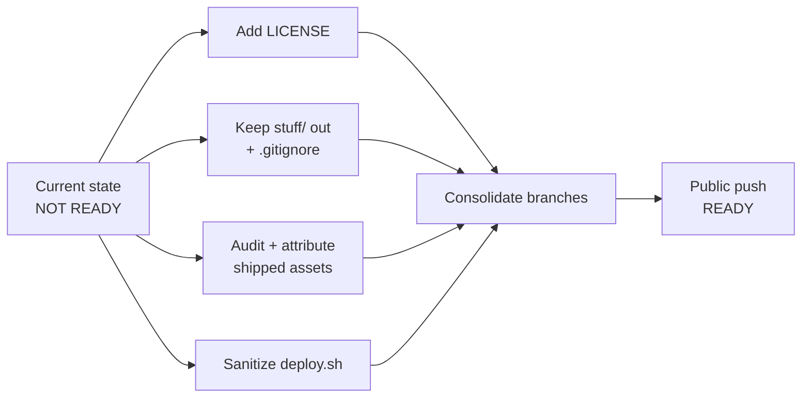

# Open-Source Readiness Report & Recommendations

**Project:** Droplet — a WebAssembly/WebGL C++ demo game (SDL2 + GLFW3 Emscripten ports, Bullet physics, custom render abstraction over OpenGL ES / WebGL).
**Repo root:** `/Users/leny/work/demos/webgame/test1`
**Date:** 2026-06-15
**Audience:** maintainers (Leny Kholodov, Ievgen Mukhin) preparing the first public release.

---

## 1. Executive Summary & Verdict

Droplet is a self-contained, well-layered custom engine and game. The C++ source is clean (no committed secrets or credentials), uses a permissively-licensed third-party submodule ([fast_obj](../third-party/fast_obj), MIT), and builds with a single `make -j`. The engine architecture is sound and presentable.

However, **the repository is NOT ready for a public push.** The blocking issues are almost entirely **legal/licensing and provenance**, not code quality:

- No `LICENSE` file exists, and no source file carries a license header — the code is currently "all rights reserved" by default and cannot be legally reused by anyone.
- An untracked `stuff/` directory in the working tree contains **proprietary, redistribution-restricted Intel software** and a compiled Windows binary. If it were ever committed and pushed, it would be a license violation that is hard to fully retract from git history.
- Several **shipped, git-tracked assets** (music, sound effects, textures, fern meshes) have unverified or attribution-required licenses. At least one (the fern model) is **CC-BY-4.0 and legally requires a credit line that is currently absent.**

> ### Verdict: **NOT READY — 6 blockers.**
> All 6 are resolvable. None require code rewrites; they require a license decision, an asset-provenance audit, and basic repo hygiene. Estimated effort to clear all blockers: **roughly 1–2 focused days**, dominated by tracking down the `music.mp3` and texture licenses.



---

## 2. Blockers — Must Fix Before Any Public Push

These must all be resolved before the first `git push` to a public remote. Effort key: **S** = under 1 h, **M** = a few hours, **L** = up to a day (mostly external license research).

| # | Issue | Risk | Recommended action | Effort |
|---|-------|------|--------------------|--------|
| B1 | **No `LICENSE` file**, no source headers. Copyright: Leny Kholodov (primary) + Ievgen Mukhin (2023). | Without a license the default is *all rights reserved*: nobody may legally copy, modify, or reuse the code. Publishing without one defeats the purpose and creates ambiguity. | Add a top-level `LICENSE` (recommend **MIT**, see §5). Get explicit sign-off from **both** copyright holders since Ievgen Mukhin is a tracked contributor (`git log` shows `muhineg@gmail.com`). Add a short SPDX header to source files (see §3). | S |
| B2 | **`stuff/` (15 MB, untracked) contains proprietary code.** `stuff/waterplane/` ships Intel IJL (`ijl15.lib`, `ijl15l.lib`, `ijl15.dll`, `ijl.h`) — proprietary, redistribution-restricted — plus prebuilt GLEW/GLUT `.lib`/`.dll`, a compiled `pgl.exe`, and `stuff/"20030524 (1).rar"`. | **Highest legal risk.** Committing/pushing the Intel IJL binaries or `pgl.exe` would violate Intel's license and ship a Windows executable of unknown provenance. Hard to scrub from history once pushed. | **Never commit `stuff/`.** Add `stuff/` to `.gitignore` (see §3) *before* any `git add -A`, and ideally delete it locally or move it outside the repo tree. Verify with `git ls-files stuff/` returns empty (confirmed empty today — keep it that way). | S |
| B3 | **`dist/sounds/music.mp3` (3 MB) — unknown source/license.** | **Highest-risk shipped asset.** Music is the most common source of takedowns/DMCA. An unlicensed track makes the whole repo non-distributable. | Identify the track's origin. If license can't be confirmed as redistributable, **replace it** with a CC0 / CC-BY track (e.g. from incompetech, Free Music Archive, or freesound) and credit it. Do not publish until resolved. | L |
| B4 | **freesound SFX — confirm licenses + add attribution.** `dist/sounds/177156__abstudios__water-drop.wav` and `267221__gkillhour__water-droplet.wav`. Filenames are freesound.org IDs by `abstudios` (177156) and `gkillhour` (267221). | Freesound mixes CC0, CC-BY, and CC-BY-NC. **CC-BY-NC would forbid commercial reuse**; CC-BY requires attribution. Shipping without confirming/crediting risks license breach. | Look up each ID at `freesound.org/s/<id>/`, record the exact license, and add credit lines (see §6). If either is **NC**, decide whether NC is acceptable for the project or replace with a CC0/CC-BY equivalent. | M |
| B5 | **Fern art assets are CC-BY-4.0 and require an (absent) credit line.** `stuff/ferns_lowpoly_model/license.txt` = CC-BY-4.0 by **adam127**. The shipped, tracked [media/textures/ferns_1_diffuse.png](../media/textures/ferns_1_diffuse.png) + `ferns_1_normal.png` and the meshes [media/meshes/fern.obj](../media/meshes/fern.obj)/`.mtl` (and `leaf.*`, which reference these textures) **derive from this model** — `fern.mtl` maps `../textures/ferns_1_diffuse.png` / `ferns_1_normal.png`. | CC-BY-4.0 legally **requires** crediting the author wherever the work is shared. Distributing without the exact credit line breaches the license. | Add the **exact** required credit line (see §6) to a `CREDITS.md`/`ATTRIBUTION.md` and the README. Commercial use is allowed, so no replacement needed — attribution alone satisfies the license. | S |
| B6 | **`deploy.sh` hardcodes a server IP + root SSH.** Content: `scp -r dist/* root@134.209.73.43:/var/www/html/droplet` (a DigitalOcean host). Currently **untracked** (never committed → no history leak). | Publishing a real host IP + `root@` login is an infrastructure-exposure footgun and is meaningless to external users. | Do not commit as-is. Either parameterize it (`scp -r dist/* "${DEPLOY_TARGET:?set DEPLOY_TARGET}":...`) and commit the sanitized version, or add `deploy.sh` to `.gitignore`. Confirm the host's exposure is acceptable regardless. | S |

> **Also re-verify before push (provenance unknowns, treat as blocking until cleared):** every file under [media/textures/](../media/textures) — `brickwall_*`, `floor_*`, `stone_*` (diffuse/normal/specular `.jpg`), `leaf_color.png`/`leaf_normal.png`, the `sky_{posx,negx,posy,negy,posz,negz}.png` cubemap, `stem_texture_01.png`, and `projectile.png`. Many resemble common PBR sample textures, but **provenance is unknown.** Each must be confirmed redistributable or replaced (see §6 checklist).

---

## 3. Should-Fix — Quality & Hygiene

Strongly recommended for a credible public release, but not legal blockers.

### 3.1 Consolidate branch sprawl
`git branch -a` shows divergence:

```
dev*  main  master
remotes/origin/HEAD -> origin/main
remotes/origin/main  remotes/origin/master  remotes/public/main
```

`main` / `public/main` are single squashed commits; `dev` / `master` carry the full 60+ commit history. **Pick ONE canonical public branch and history** before open-sourcing so contributors aren't confused about the source of truth. Recommended: make `main` the canonical branch with the real history (or a deliberately-squashed clean history if you want to drop the `stuff/`-era noise), and delete or archive the rest.

### 3.2 Add `stuff/` (and friends) to `.gitignore`
Current [.gitignore](../.gitignore) only ignores build output:

```gitignore
dist/index.js
dist/index.wasm
dist/index.wasm.map
dist/index.data
tmp/
.DS_Store
```

Append at minimum:

```gitignore
stuff/
deploy.sh        # or sanitize and commit instead
```

This is a defense-in-depth measure against accidentally committing the proprietary `stuff/` content (B2).

### 3.3 Separate the web shell from build output
[dist/](../dist) currently mixes a **hand-written** `index.html` shell (1.5 KB, tracked) and three tracked sound files with **generated** Emscripten output (`index.js`, `index.wasm`, `index.wasm.map`, `index.data` — all gitignored). This is awkward: `dist/` reads as "build artifacts" but also holds source-of-truth files. Recommend a `web/` (or `shell/`) directory for the hand-written `index.html` + `sounds/`, and let the Makefile emit purely-generated output into `dist/`. The Makefile's `OUT_DIR := dist` / `TARGET := $(OUT_DIR)/index.js` would change to point at the generated dir.

### 3.4 Write a real README
Current [readme.md](../readme.md) is build-steps-only. A public README should add:
- One-paragraph project description (drag leaves to stagger them → physics-driven water droplets fall → grow ferns).
- Screenshot or GIF, and/or a live demo link.
- Controls.
- **Build prerequisites** (Emscripten/`emcc`, `make`) and the critical `git submodule update --init` step for [third-party/fast_obj](../third-party/fast_obj) — currently missing and will break a fresh clone's build.
- Tech stack, architecture overview (link the layers: `common` → `math` → `media` → `render/low_level` → `render/scene` → `scene` → `application` → `launcher`).
- License + credits/attribution section.

### 3.5 Add SPDX license headers to source
Once the license is chosen (§5), add a one-line header to first-party `.cpp`/`.h` files, e.g.:

```cpp
// SPDX-License-Identifier: MIT
// Copyright (c) 2023 Leny Kholodov, Ievgen Mukhin
```

Do **not** add headers to vendored code under [third-party/](../third-party).

### 3.6 Clean up the `test only` TODO
[src/launcher/world.cpp](../src/launcher/world.cpp) line 1171:

```cpp
            ///TODO test only!!!!!

        //droplet->hull_mesh->set_position(droplet->center);
```

Review and remove this scaffolding (and the commented-out lines beneath it) before release. Other `//TODO`s in the tree are benign, and the `hull_loop_tesselation_smoother.cpp` "reference, crashes on Android" note documents a real workaround — fine to leave but worth a sentence in a known-issues list.

---

## 4. Nice-to-Have — Community & Automation

| Item | Why | Notes |
|------|-----|-------|
| `CONTRIBUTING.md` | Tells contributors how to build, the submodule step, code style, and PR expectations. | Reuse the README build section. |
| `CODE_OF_CONDUCT.md` | Standard for inviting external contributors. | Contributor Covenant boilerplate is fine. |
| Issue & PR templates (`.github/`) | Lower friction for good bug reports. | Bug / feature templates. |
| **CI (GitHub Actions)** | Build the WASM on every push/PR to catch breakage. | Use `mymindstorm/setup-emsdk`, `git submodule update --init`, then `make -j`. Cache `tmp/`. |
| Live demo link / screenshot | Demos sell themselves; a hosted build dramatically raises engagement. | Host the `dist/` output (GitHub Pages works for static WASM). |
| `CREDITS.md` / `ATTRIBUTION.md` | Centralizes the asset attributions from §6 (also satisfies B4/B5 legally). | See ready-made checklist in §6. |

---

## 5. Recommended License

**Recommendation: MIT for the engine + game code (`src/`, `include/`).**

Rationale:

1. **Fits a demo/engine.** MIT is short, permissive, and the de-facto standard for showcase engines and graphics demos. It maximizes reuse and learning value, which is the point of open-sourcing a tech demo.
2. **Third-party compatibility.** The only vendored dependency, [third-party/fast_obj](../third-party/fast_obj), is **MIT** (`Copyright (c) 2018 thisistherk`). MIT-on-MIT is frictionless — no relicensing or notice conflicts. Keep fast_obj's own `LICENSE` intact in its submodule directory.
3. **No patent concerns that would push toward Apache-2.0.** This is a graphics/physics demo, not patent-sensitive. Apache-2.0 is a fine alternative if you specifically want its explicit patent grant and `NOTICE` mechanics, but MIT's simplicity wins here.

**Critical distinction — code license ≠ asset license.** The MIT `LICENSE` covers **code only**. The art and audio assets carry their **own** licenses and are *not* relicensed by your MIT file:

- The fern model and its derived textures/meshes are **CC-BY-4.0** (adam127) — attribution required, separate from MIT.
- Sound effects carry their individual freesound licenses (CC0 / CC-BY / CC-BY-NC — TBD).
- `music.mp3` and the remaining textures are **TBD** and may need replacement.

State this split explicitly in the README, e.g.:

> The source code in this repository is licensed under the MIT License (see `LICENSE`). Art and audio assets are licensed separately under their own terms — see `CREDITS.md`.

---

## 6. Attribution / Credits Checklist

Create `CREDITS.md` (and mirror a short version in the README). Track each asset to a confirmed license before release.

### Required now (license is known)

- [ ] **Ferns model + derived textures/meshes** — `media/textures/ferns_1_diffuse.png`, `ferns_1_normal.png`, `media/meshes/fern.obj`/`.mtl`, `leaf.obj`/`.mtl`.
  License: **CC-BY-4.0**, author **adam127**. Paste the **exact** required credit line verbatim:
  > This work is based on "Ferns lowpoly model" (https://sketchfab.com/3d-models/ferns-lowpoly-model-34fffcb1f90d4bb2a3bd362f38abbe80) by adam127 (https://sketchfab.com/adam127) licensed under CC-BY-4.0 (http://creativecommons.org/licenses/by/4.0/)

### Must confirm license, then credit

- [ ] **`dist/sounds/177156__abstudios__water-drop.wav`** — freesound.org ID **177156**, author **abstudios**. Confirm license at `https://freesound.org/s/177156/`; record license + add credit. *(Blocks if CC-BY-NC and commercial use is intended.)*
- [ ] **`dist/sounds/267221__gkillhour__water-droplet.wav`** — freesound.org ID **267221**, author **gkillhour**. Confirm license at `https://freesound.org/s/267221/`; record license + add credit.
- [ ] **`dist/sounds/music.mp3`** — **source/license TBD (highest risk).** Verify rights or replace with a CC0/CC-BY track; then credit.

### Provenance unknown — confirm redistributable or replace, then credit if required

- [ ] `media/textures/brickwall_diffuse.jpg`, `brickwall_normal.jpg`, `brickwall_specular.jpg` — **TBD**
- [ ] `media/textures/floor_diffuse.jpg`, `floor_normal.jpg`, `floor_specular.jpg` — **TBD**
- [ ] `media/textures/stone_diffuse.jpg`, `stone_normal.jpg`, `stone_specular.jpg` — **TBD**
- [ ] `media/textures/leaf_color.png`, `leaf_normal.png` — **TBD** (verify whether these also derive from the fern/leaf source)
- [x] ~~`media/textures/sky_*.png` (skybox cubemap) — TBD~~ **RESOLVED.** Replaced with a cubemap derived from ESO/S. Brunier's "The Milky Way panorama" (`media/textures/sky_*.jpg`). License: **CC BY 4.0** — attribution required (see [media/textures/sky_CREDITS.txt](../media/textures/sky_CREDITS.txt)). Required credit: *Milky Way panorama: ESO/S. Brunier, CC BY 4.0 (https://creativecommons.org/licenses/by/4.0/), reprojected to a cubemap.*
- [ ] `media/textures/stem_texture_01.png` — **TBD**
- [ ] `media/textures/projectile.png` — **TBD**

### Code attribution (already satisfied, keep it that way)

- [ ] **fast_obj** — MIT, `Copyright (c) 2018 thisistherk`. Keep `third-party/fast_obj/LICENSE` in place; mention in README.

---

## 7. Path to Release — Ordered Checklist

Do these in order. Steps 1–6 are blockers; 7–10 are strongly recommended; 11–13 are polish.

1. **Get explicit license sign-off** from both copyright holders (Leny Kholodov, Ievgen Mukhin), then add the **MIT `LICENSE`** at repo root (§5). *(B1)*
2. **Quarantine `stuff/`:** add `stuff/` to `.gitignore`, delete or move it outside the repo, and verify `git ls-files stuff/` is empty. Never `git add` it. *(B2)*
3. **Sanitize `deploy.sh`:** parameterize the host via env var, or add `deploy.sh` to `.gitignore`. *(B6)*
4. **Audit shipped assets:** confirm freesound SFX licenses (177156, 267221) and resolve `music.mp3` — replace if not confirmed redistributable. *(B3, B4)*
5. **Audit `media/textures/`:** confirm each texture is redistributable or replace it. *(provenance unknowns)*
6. **Write `CREDITS.md`** with the exact CC-BY-4.0 fern credit line and all confirmed asset licenses; link it from the README. *(B5)*
7. **Add SPDX headers** to first-party `src/`/`include/` files (not `third-party/`). *(§3.5)*
8. **Rewrite `readme.md`:** description, screenshot/demo link, controls, prerequisites, the `git submodule update --init` step, architecture, license + credits. *(§3.4)*
9. **Remove the `world.cpp:1171` `test only` scaffolding** and skim for other release-blocking TODOs. *(§3.6)*
10. **Consolidate branches:** choose one canonical public branch/history; delete/archive the rest. *(§3.1)*
11. **(Optional) Separate `web/` shell from generated `dist/`** output and update the Makefile. *(§3.3)*
12. **(Optional) Add CI** (Emscripten setup + submodule init + `make -j`), and community files (`CONTRIBUTING.md`, `CODE_OF_CONDUCT.md`, issue/PR templates). *(§4)*
13. **Final pre-push sweep:** `git status` clean of `stuff/`/`deploy.sh`, `git grep` for stray IPs/credentials, confirm `LICENSE` + `CREDITS.md` present, then push the canonical branch to the public remote. **(§4)**

---

*Report generated from a direct read of the repository at `/Users/leny/work/demos/webgame/test1` (152 tracked files, ~58 MB working tree). All file paths, license terms, and code references above were verified against the actual source.*
