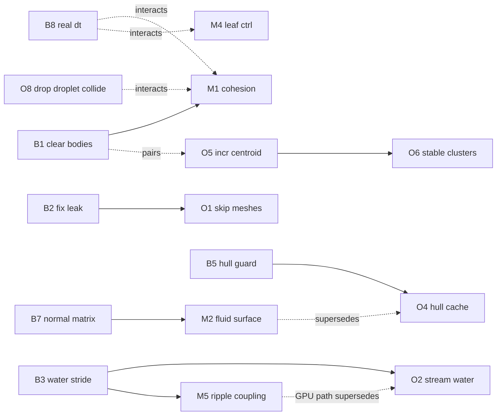

# Physics / Fluid-Simulation Fix Plan

Actionable backlog derived from the physics review of the droplet simulation
([world.cpp](../src/launcher/world.cpp), [hull/](../src/launcher/hull/),
[fresnel.glsl](../media/shaders/fresnel.glsl)). Full rationale for each item lives in the
review; this file is the **task tracker**: IDs, locations, dependencies, effort, priority.

**Legend** — Effort: `XS` ≤ a few lines · `S` < 1 h · `M` a few hours · `L` a day+.
Severity reflects the verified impact. "Supersedes / superseded-by" marks alternative
approaches (do one or the other, not both).

---

## 1. Priority backlog (sorted)

| Pri | ID | Task | Sev | Effort | Depends on | Notes |
|-----|----|------|-----|--------|-----------|-------|
| **P0** | [B1](#b1) | Clear `droplet->bodies` each clustering pass — ✅ **DONE** | High | XS | — | blocks [M1](#m1) |
| **P0** | [B3](#b3) | Fix water height-field vertex stride — ✅ **DONE** | High | S | — | blocks [O2](#o2), [M5](#m5) |
| **P0** | [B4](#b4) | Clamp water noise splash (OOB write) — ✅ **DONE** | Low | XS | — | do with [B3](#b3) |
| **P0** | [B5](#b5) | Guard empty/degenerate convex-hull input — ✅ **DONE** | Med | S | — | blocks [O4](#o4) |
| **P0** | [B6](#b6) | Fix null-deref in `contact_added_callback` — ✅ **DONE** | High | S | — | — |
| **P1** | [B2](#b2) | Destroy fallen particles (`phys_bodies` leak) — ✅ **DONE** | High | M | — | blocks [O1](#o1) |
| **P1** | [B8](#b8) | Pass real frame `dt` to `stepSimulation` — ✅ **DONE** | High | M | — | interacts [M1](#m1),[M4](#m4) |
| **P1** | [B7](#b7) | Normal matrix for non-uniform scale | High | M | — | benefits [M2](#m2) |
| **P1** | [O1](#o1) | Skip invisible per-particle scene meshes — ✅ **DONE** | Med | S | [B2](#b2) | — |
| **P2** | [O5](#o5) | Incremental centroid (O(n²)→O(n)) | Low | S | — | pairs with [B1](#b1) |
| **P2** | [O2](#o2) | Stream water VBO (dynamic, y+normal only) — ✅ **DONE** (core) | Med | M | [B3](#b3) | superseded-by GPU path in [M5](#m5) |
| **P2** | [O3](#o3) | Throttle/​shrink droplet env-map cubemaps | Med | M | — | — |
| **P2** | [O4](#o4) | Cache/throttle hull rebuild; drop redundant work | Med | S | [B5](#b5) | superseded-by [M2](#m2) |
| **P2** | [O7](#o7) | Micro-cleanups (RNG, ring buffer, hasher) | Nit | S | — | — |
| **P2** | [O9](#o9) | Release build profile (no source maps, LTO) | Low | XS | — | quick win, non-physics |
| **P3** | [M1](#m1) | Better cohesion (damping, gate, magnitude) — ✅ **DONE** | Med | M | [B1](#b1) | interacts [B8](#b8),[O8](#o8) |
| **P3** | [M3](#m3) | Leaf shape (convex/GImpact) + real inertia | Med | M | — | — |
| **P3** | [M4](#m4) | Fix leaf controller dt + keep body awake | Low | S | — | interacts [B8](#b8) |
| **P3** | [M5](#m5) | Couple water ripples to droplet impacts | Low | M | [B3](#b3) | — |
| **P3** | [O6](#o6) | Stable clustering (nearest, frozen centers) | Low | M | [O5](#o5) | — |
| **P3** | [O8](#o8) | Drop droplet↔droplet collision (optional) | Nit | S | [M1](#m1) | only if cohesion defines shape |
| **P3** | [M2](#m2) | Replace hull with metaball/screen-space fluid | Med | L | [B7](#b7) | supersedes [O4](#o4) |

---

## 2. Dependency graph

---

## 3. Suggested execution order

1. **Quick correctness sweep (P0):** [B1](#b1), [B3](#b3)+[B4](#b4), [B5](#b5), [B6](#b6) — all small, fix real bugs/crashes, no dependencies. Land as one PR. Add [O9](#o9) as a freebie.
2. **Lifecycle + integration (P1):** [B2](#b2) → [O1](#o1); then [B8](#b8); then [B7](#b7).
3. **Perf pass (P2):** [O5](#o5), [O2](#o2), [O3](#o3), [O4](#o4), [O7](#o7).
4. **Model / realism (P3):** [M1](#m1) (now measurable after [B1](#b1)+[B8](#b8)), [M3](#m3), [M4](#m4), [M5](#m5), [O6](#o6). Decide [M2](#m2) vs [O4](#o4) — if you commit to [M2](#m2), skip [O4](#o4).

---

## 4. Tasks — Correctness bugs

### B1 — Clear the `droplet->bodies` vector each clustering pass  ·  ✅ DONE
- **Loc:** [world.cpp:1003-1007](../src/launcher/world.cpp#L1003-L1007) · **Sev:** High · **Effort:** XS
- **Fixed:** `bodies.clear()` added to the reset. Note this removed an accidental Nx cohesion-force multiplier, which required completing [M1](#m1) to restore droplet binding.
- **Why:** the per-pass reset clears `points`/`hull_builder` but never `bodies`, so it accumulates across the 3 passes *and* across frames for surviving droplets. The cohesion loop applies `applyCentralForce` once per entry → force ramps up over a droplet's lifetime (over-compression, jitter, blow-up) plus unbounded memory.
- **Fix:** add `droplet->bodies.clear();` next to `droplet->points.clear();`.
- **Unblocks:** [M1](#m1) (can't tune cohesion while it's multiplied). Pairs with [O5](#o5).

### B2 — Destroy fallen particles (`phys_bodies` / Bullet-world leak)  ·  ✅ DONE
- **Loc:** [world.cpp:991-993](../src/launcher/world.cpp#L991-L993), push at [:862](../src/launcher/world.cpp#L862), sync at [:1280](../src/launcher/world.cpp#L1280) · **Sev:** High · **Effort:** M
- **Fixed:** fallen particles are now also `remove_if`'d from `phys_bodies` so `~PhysBodySync` runs. Exposed (and fixed) a latent null-deref: `PhysBodySync` never stored its `dynamics_world` member, so the destructor crashed once bodies actually got destroyed.
- **Why:** a fallen particle (y < −6) is erased only from `droplet_particles`, never from the master `phys_bodies`, so `~PhysBodySync` (which calls `removeRigidBody`) never runs. The body keeps falling forever in the Bullet world and is transform-synced every frame. ~150 leaked bodies/min → monotonic frame-time + memory growth.
- **Fix:** tag `PhysBodySync` dead on fall and `remove_if` it from `phys_bodies` too (leave ground/leaf bodies untouched).
- **Unblocks:** [O1](#o1).

### B3 — Fix water height-field vertex stride mismatch  ·  ✅ DONE
- **Loc:** [world.cpp:394-416](../src/launcher/world.cpp#L394-L416) vs layout [:331-339](../src/launcher/world.cpp#L331-L339) · **Sev:** High · **Effort:** S
- **Fixed:** the inner loop now indexes `&verts[i*N + j]` explicitly instead of advancing one pointer per interior cell. Verified in-engine: the diagonal wave shear is gone, ripples render correctly.
- **Why:** the write pointer advances `v++` once per interior cell (+126/row) but the mesh stride is 128, so `U[i][j]` is written to the wrong vertex — the simulated wave shears diagonally relative to the rendered surface, and borders freeze at y=0.
- **Fix:** index explicitly: `Vertex* v = &mesh.vertices_data()[i*WATER_SURFACE_GRID_SIZE + j];` inside the loop (or `v += 2;` per row).
- **Unblocks:** [O2](#o2), [M5](#m5).

### B4 — Clamp water noise splash to avoid out-of-bounds write  ·  ✅ DONE
- **Loc:** [world.cpp:373-389](../src/launcher/world.cpp#L373-L389) · **Sev:** Low · **Effort:** XS
- **Fixed:** `rand() % (GRID-6)` so the 7×7 kernel at `+3` offset stays within `[0,127]`.
- **Why:** `rand() % (GRID-5)` + offset reaches index 128 in a 128-wide array → 1-cell OOB write.
- **Fix:** use `rand() % (GRID-6)` (or `3 + rand()%(GRID-6)` and drop the `+3`). Do alongside [B3](#b3).

### B5 — Guard empty / degenerate convex-hull input  ·  ✅ DONE
- **Loc:** [hull.cpp:96](../src/launcher/hull/hull.cpp#L96), call site [world.cpp:1228-1231](../src/launcher/world.cpp#L1228-L1231) · **Sev:** Med · **Effort:** S
- **Fixed:** `build_hull` returns false for `< 12` floats (4 points) before indexing the empty vector; the call site hides the droplet's stale hull mesh on failure.
- **Why:** `&impl->input_vertices[0]` on an empty vector is UB; `build_hull` is called unconditionally even for droplets that contributed no points, and a hull needs ≥4 non-coplanar points.
- **Fix:** `if (impl->input_vertices.size() < 12) return false;` before line 96; only call `build_hull` for droplets past `MIN_DROPLET_PARTICLES_COUNT`. On failure, hide/unbind that droplet's mesh.
- **Unblocks:** [O4](#o4).

### B6 — Fix null-pointer deref in `contact_added_callback`  ·  ✅ DONE
- **Loc:** [world.cpp:270](../src/launcher/world.cpp#L270), anchor created [:781-785](../src/launcher/world.cpp#L781-L785) · **Sev:** High · **Effort:** S
- **Fixed:** the callback null-checks both `RigidBodyInfo`s, and the leaf constraint anchor is now registered with mask 0 (collides with nothing), so a droplet can't trigger the callback against it.
- **Why:** the `static_bind_body` constraint anchor never gets `setUserPointer`, so a droplet touching the tiny r=0.01 pivot sphere dereferences a null `RigidBodyInfo` → crash. (Narrow trigger, but reachable during normal leaf play.)
- **Fix:** flag the anchor `CF_NO_CONTACT_RESPONSE` (or a no-collide group/mask) so it's a pure constraint anchor; also null-check both infos at the top of the callback and `return false`.

### B7 — Add a normal matrix (inverse-transpose) for non-uniform scale
- **Loc:** [fresnel.glsl:36](../media/shaders/fresnel.glsl#L36), model matrix set in [pass.cpp:220](../src/render/low_level/pass.cpp#L220), water scale [world.cpp:366](../src/launcher/world.cpp#L366) · **Sev:** High · **Effort:** M
- **Why:** the water node is scaled (250, 2, 250) but the shader transforms normals with the raw model matrix — no inverse-transpose anywhere in the engine. Ripple-slope normals get x/z amplified ~125× → wrong fresnel/reflections (affects every non-uniformly-scaled mesh).
- **Fix:** compute + upload the inverse-transpose 3×3 normal matrix and use it in the vertex shader; or pre-divide the height-field normal's x/z by the scale on the CPU as a water-only shortcut.
- **Benefits:** [M2](#m2).

### B8 — Pass the real frame delta to `stepSimulation`  ·  ✅ DONE
- **Loc:** [world.cpp:943](../src/launcher/world.cpp#L943); real `dt` already computed + discarded at [main.cpp:413](../src/launcher/main.cpp#L413) · **Sev:** High · **Effort:** M
- **Done:** `dt` is threaded `main.cpp` → `World::update(float dt)` → `stepSimulation(min(dt,0.25), 10, 1/60)`; the water wave/swell sim runs once per returned substep, so it's real-time too. At ~60fps behaviour is unchanged (1 substep); other rates are now correct. Cohesion re-validated (still ~24 particles/droplet).
- **Why:** a hardcoded `1.f/60.f` makes physics advance exactly 1/60 s per rendered frame → 0.5× speed at 30 fps, ~2× at 120 Hz. (`maxSubSteps=10` is also dead because timeStep == fixedTimeStep.)
- **Fix:** thread the real `dt` through `World::update(dt)` and call `stepSimulation(min(dt,0.25f), 10, 1.f/60.f)`. Drive the water step ([M5](#m5)/[O2](#o2)) from the same fixed accumulator.
- **Interacts:** [M1](#m1), [M4](#m4) (re-tune after this lands).

---

## 5. Tasks — Model / physical plausibility

### M1 — Improve the droplet cohesion model  ·  ✅ DONE
- **Loc:** [world.cpp:1246-1254](../src/launcher/world.cpp#L1246-L1254) · **Sev:** Med · **Effort:** M · **Depends:** [B1](#b1)
- **Fixed:** raised the centroid spring (`DROPLET_PARTICLE_FORCE` 0.0004 → 0.02) now that [B1](#b1) removed the force multiplier, added velocity damping (`DROPLET_PARTICLE_DAMPING`), and removed the upper distance gate. Particles/droplet recovered from ~1 (scattered) to ~24. A full SPH/surface-tension model (Akinci 2013) remains a future option.
- **Why:** it's an undamped centroid spring that is ~75× too weak to bind (≈0.2 vs 15 m/s²), and the upper-distance gate (>1.0 → zero force) abandons exactly the stragglers cohesion should reclaim.
- **Fix:** remove the upper gate; add damping `F = k(center−pos) − c·vel`, `c ≈ 2√(km)`; raise magnitude to target a few m/s². For real behavior, move to a neighbor-summed SPH cohesion + surface-tension term (Akinci 2013).
- **Interacts:** [B8](#b8) (tune after real dt), [O8](#o8).

### M2 — Replace the convex-hull surface with a true fluid surface
- **Loc:** [hull.cpp:86-162](../src/launcher/hull/hull.cpp#L86-L162) · **Sev:** Med · **Effort:** L · **Depends:** [B7](#b7) · **Supersedes:** [O4](#o4)
- **Why:** a convex hull cannot make concavities, necking, or merges — it always reads as a rounded blob, and normals are faked as radial (`//???` at [hull.cpp:145](../src/launcher/hull/hull.cpp#L145)).
- **Fix:** build an SPH/metaball density field + marching cubes (handles merge/concavity, cheap at low grid res), **or** screen-space fluid (depth → bilateral blur → thickness, no CPU mesh — cheapest for WebGL). Either removes the per-frame CPU hull+subdivision cost.

### M3 — Proper leaf collision shape + inertia
- **Loc:** shape [world.cpp:694](../src/launcher/world.cpp#L694), inertia [:704](../src/launcher/world.cpp#L704) · **Sev:** Med · **Effort:** M
- **Why:** dynamic leaves use `btBvhTriangleMeshShape` (static-only in Bullet; correct `btGImpactMeshShape` is commented out right below), and inertia is hardcoded isotropic `(1,1,1)·m` so a flat leaf rotates like a solid sphere.
- **Fix:** use a convex hull / thin box (leaves are nearly flat) or register + use `btGImpactMeshShape`; call `shape->calculateLocalInertia(mass, …)`.

### M4 — Fix the leaf PD controller
- **Loc:** [world.cpp:951-974](../src/launcher/world.cpp#L951-L974), `TIME_STEP` [:957](../src/launcher/world.cpp#L957) · **Sev:** Low · **Effort:** S
- **Why:** controller `TIME_STEP=0.025` ≠ sim step 1/60, and the leaf can fall asleep and stop responding to forces.
- **Fix:** express as an explicit critically-damped PD (`Kp`/`Kd` per second), drive from the fixed step, and `activate(true)` (or `DISABLE_DEACTIVATION`) when applying a corrective force.
- **Interacts:** [B8](#b8).

### M5 — Couple the water ripples to droplet impacts
- **Loc:** noise source [world.cpp:371-390](../src/launcher/world.cpp#L371-L390), plane offset [:94](../src/launcher/world.cpp#L94) · **Sev:** Low · **Effort:** M · **Depends:** [B3](#b3)
- **Why:** ripples come only from `rand()` and the plane sits below the playable region — the water never reacts to gameplay.
- **Fix:** place the plane where droplets reach it (or route impacts onto it); on droplet contact inject a small Gaussian dip into `U` at the droplet's mapped (x,z). A GPU height-field here also supersedes [O2](#o2).

---

## 6. Tasks — Optimizations & cleanups

### O1 — Don't create/sync invisible per-particle scene meshes  ·  ✅ DONE
- **Loc:** [world.cpp:855-857](../src/launcher/world.cpp#L855-L857), sync [:1280](../src/launcher/world.cpp#L1280) · **Sev:** Med · **Effort:** S · **Depends:** [B2](#b2)
- **Fixed:** when `DROPLET_DEBUG_DRAW` is off, no per-particle `scene::Mesh` is allocated; the sync loop skips null meshes.
- **Fix:** when `DROPLET_DEBUG_DRAW` is false, skip per-particle `scene::Mesh` creation and exclude particles from the sync loop — they're never rendered.

### O2 — Stream the water buffer instead of full re-upload  ·  ✅ DONE (core)
- **Loc:** `touch()` [world.cpp:424](../src/launcher/world.cpp#L424), [mesh.cpp:67-97](../src/render/low_level/mesh.cpp#L67-L97), [buffer.cpp:38](../src/render/low_level/buffer.cpp#L38) · **Sev:** Med · **Effort:** M · **Depends:** [B3](#b3)
- **Why:** the full 16 384-vertex VBO **and** the static index buffer were re-uploaded every frame (~975 KB/frame) as `GL_STATIC_DRAW`.
- **Done:** index/primitive re-upload is skipped when topology is unchanged (B3-era); the vertex buffer auto-promotes to `GL_DYNAMIC_DRAW` the first frame it's streamed (via `update_geometry` → `VertexBuffer::ensure_dynamic`), so the driver stops stalling on each per-frame `glBufferSubData`; dropped the redundant per-cell `normalize()` (shader normalizes).
- **Deferred:** streaming only y+normal (uploading static x/z/UV/colour once) needs a split vertex format / second VBO — left for the GPU height-field path ([M5](#m5)) that supersedes this. 64² grid not changed (would coarsen the tuned swell).

### O3 — Throttle / shrink droplet environment cubemaps
- **Loc:** [world.cpp:1083](../src/launcher/world.cpp#L1083), [mirrors_render_pass.cpp:53-64](../src/render/scene_passes/mirrors_render_pass.cpp#L53-L64) · **Sev:** Med · **Effort:** M
- **Why:** each droplet re-renders the whole scene into 6 cubemap faces every frame (up to ~18 scene renders/frame).
- **Fix:** lower cubemap resolution, refresh every Nth frame, and/or share one env map across droplets.

### O4 — Cache/throttle hull rebuild; drop redundant work
- **Loc:** [hull.cpp:86-159](../src/launcher/hull/hull.cpp#L86-L159) · **Sev:** Med · **Effort:** S · **Depends:** [B5](#b5) · **Superseded-by:** [M2](#m2)
- **Why:** the hull + Loop subdivision + full VBO re-upload run every frame even for a near-static droplet; there's a redundant re-normalize at [:145](../src/launcher/hull/hull.cpp#L145) (overwrites the smoother's normal) and a per-vertex `asin()` texcoord.
- **Fix:** skip rebuild when center/point-set is ~unchanged (you already track `prev_centers`); throttle to every 2-3 frames; delete the [:145](../src/launcher/hull/hull.cpp#L145) re-normalize; hoist the `asin()`.

### O5 — Incremental centroid (O(n²) → O(n))
- **Loc:** [world.cpp:1026-1031](../src/launcher/world.cpp#L1026-L1031) (+ duplicate sums at [:1147](../src/launcher/world.cpp#L1147), [:1157](../src/launcher/world.cpp#L1157)) · **Sev:** Low · **Effort:** S
- **Fix:** keep a running `point_sum` + count per droplet; `center = sum/count` on insert. Compute the centroid once and reuse it for the variance/hull-filter passes. Pairs with [B1](#b1).

### O6 — Stable clustering (nearest, not first; frozen centers)
- **Loc:** [world.cpp:1011-1048](../src/launcher/world.cpp#L1011-L1048) · **Sev:** Low · **Effort:** M · **Depends:** [O5](#o5)
- **Why:** greedy first-match clustering is order-dependent → frame-to-frame droplet popping.
- **Fix:** assign each particle to the *nearest* center within radius; freeze centers during a pass (use previous-frame centers, recompute once at the end); seed from previous-frame clusters.

### O7 — Micro-cleanups
- **Loc:** RNG [world.cpp:882-883](../src/launcher/world.cpp#L882-L883), `prev_centers` `std::list` [:220](../src/launcher/world.cpp#L220), `PairHasher` [:296](../src/launcher/world.cpp#L296) · **Sev:** Nit · **Effort:** S
- **Fix:** reuse one file-static `mt19937` instead of constructing `random_device`+`mt19937` per `generate_plant`; replace the `std::list` ring with a fixed `std::array<vec3f,4>` + running sum; replace the degenerate `first*second` hash with a `hash_combine` mix.

### O8 — (Optional) Drop droplet↔droplet collision
- **Loc:** masks [world.cpp:69](../src/launcher/world.cpp#L69) · **Sev:** Nit · **Effort:** S · **Depends:** [M1](#m1)
- **Why:** particle-vs-particle narrowphase dominates solver cost; if cohesion + hull fully define the look, the collisions are wasted work.
- **Fix:** remove `COLLISION_GROUP_DROPLET` from `COLLISION_MASK_DROPLET` (let particles interpenetrate). Only after [M1](#m1) gives cohesion enough authority to hold shape.

### O9 — Release build profile
- **Loc:** [Makefile:7](../Makefile#L7) · **Sev:** Low · **Effort:** XS
- **Fix:** add a release target that drops `-gsource-map` (binary bloat) and optionally adds `-flto`; keep debug flags behind a toggle. Non-physics quick win.

---

## 7. Not a bug (verified — do not "fix")

- **`clock()` for gameplay timers** ([world.cpp:931](../src/launcher/world.cpp#L931)) is correct on this target: Emscripten implements `clock()` as wall-clock (`Date.now()`), so the `CLOCKS_PER_SEC` factors cancel and the 10 s droplet interval is real-time. Only revisit if a native build is ever added.
